# Focusync Architecture Diagram

## 🏗️ High-Level Architecture

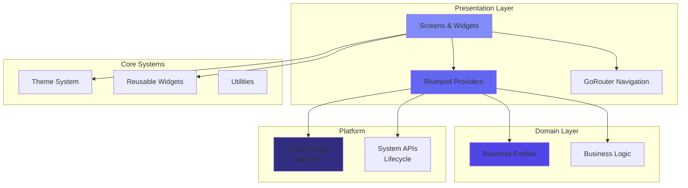

## 📱 Feature Module Structure

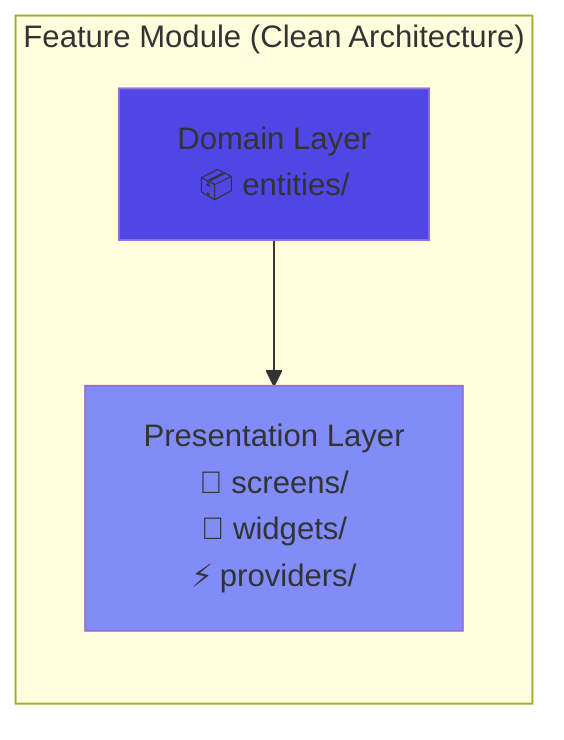

## 🔄 State Management Flow (Riverpod)

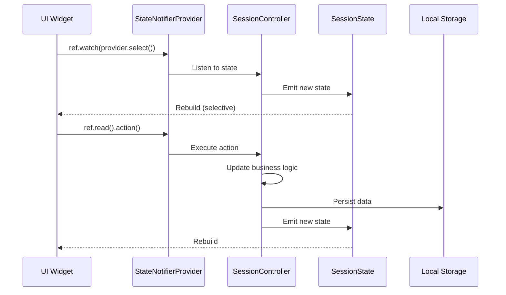

## 🎯 Session Lifecycle Flow

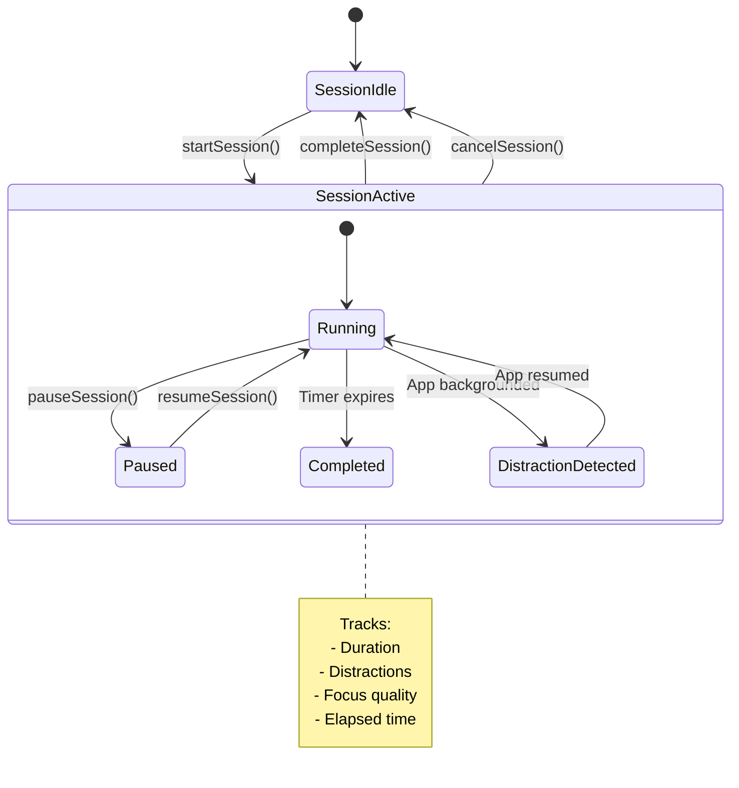

## 🗺️ Navigation Architecture

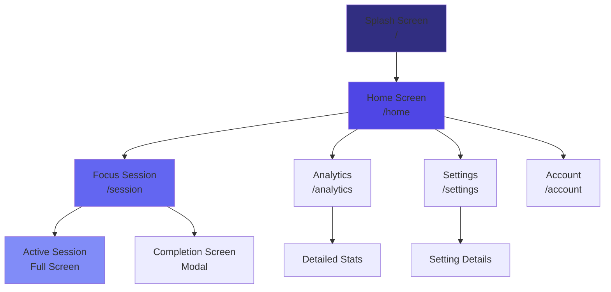

## 🏛️ Core Features Architecture

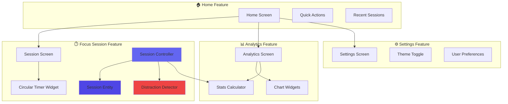

## 🎨 Theme & Design System Flow

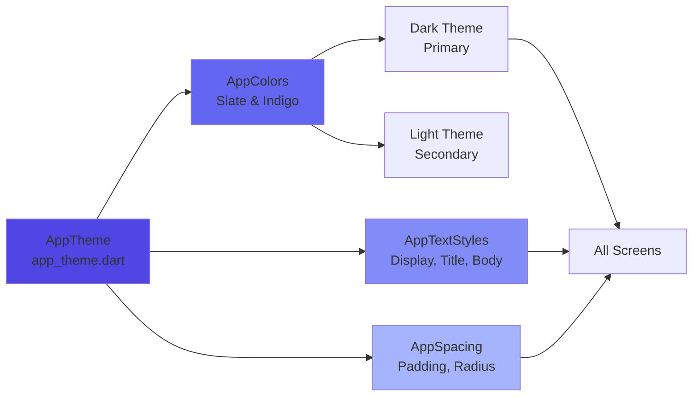

## ⚡ Performance Optimization Layers

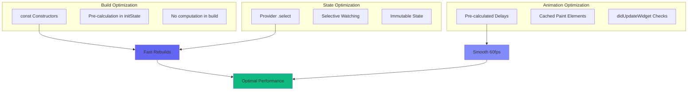

## 📦 Data Flow Architecture

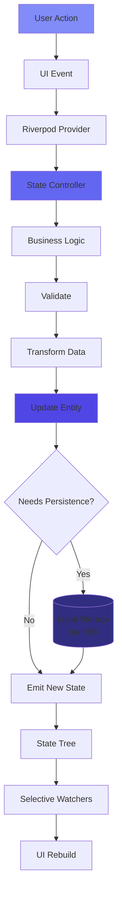

## 🔐 Privacy-First Architecture

```mermaid
graph LR
    subgraph "Local Only"
        App[Focusync App]
        LocalDB[(Local Storage)]
        Device[Device Only]
        
        App --> LocalDB
        LocalDB --> Device
    end
    
    subgraph "NO External Communication"
        NoCloud[❌ No Cloud Sync]
        NoAnalytics[❌ No Analytics]
        NoTracking[❌ No Tracking]
        NoBackend[❌ No Backend]
    end
    
    App -.x.-> NoCloud
    App -.x.-> NoAnalytics
    App -.x.-> NoTracking
    App -.x.-> NoBackend
    
    style App fill:#10b981
    style NoCloud fill:#ef4444
    style NoAnalytics fill:#ef4444
    style NoTracking fill:#ef4444
    style NoBackend fill:#ef4444
```

## 🧩 Widget Composition Pattern

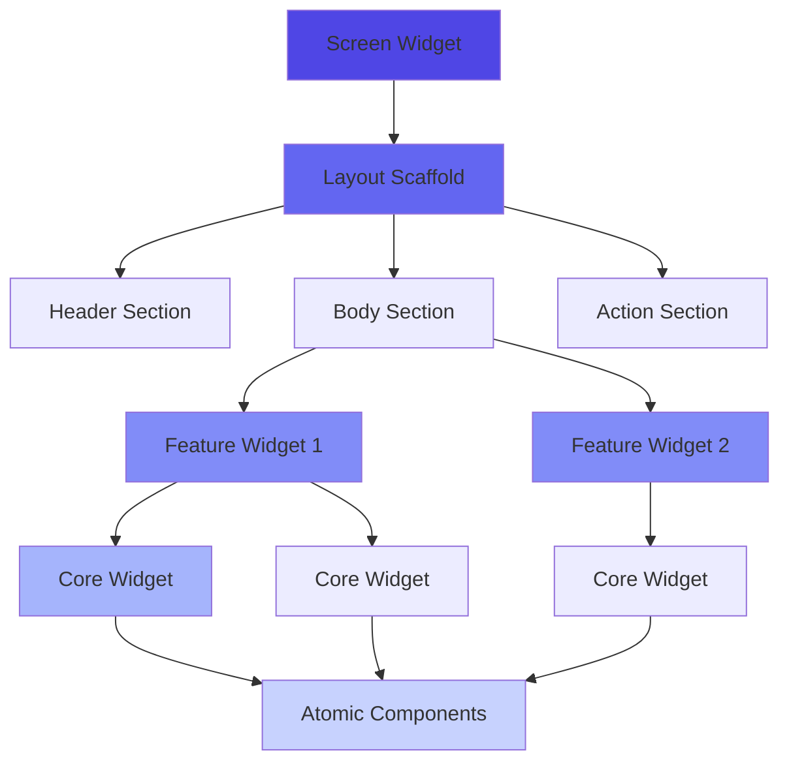

## 📂 Project Directory Structure

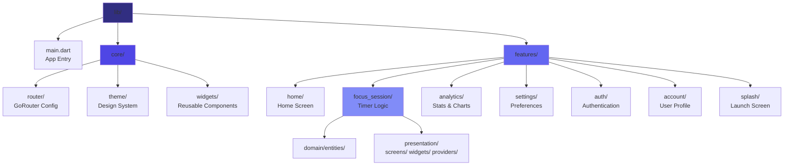

## 🎯 Key Components & Their Responsibilities

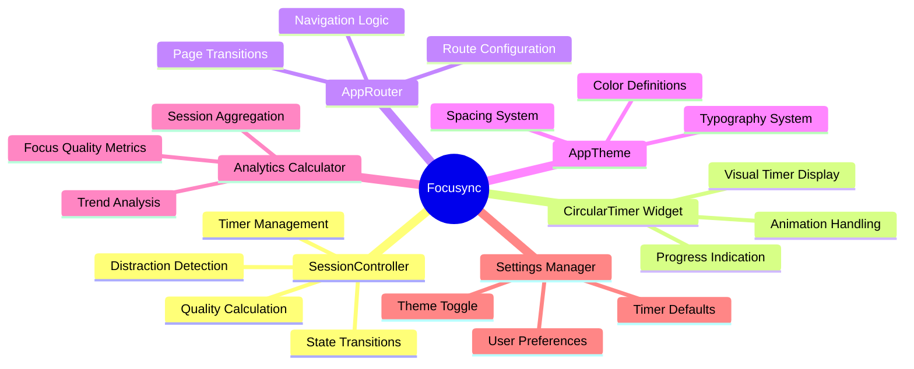

## 🔄 App Lifecycle Integration

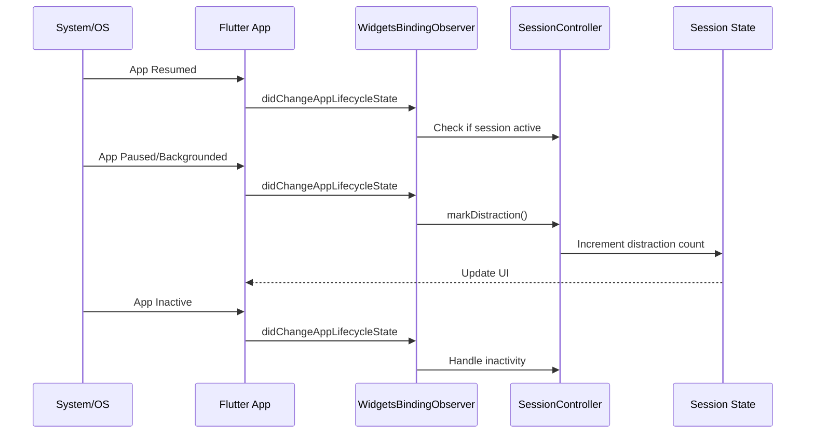

---

## 📊 Technology Stack Summary

| Layer | Technology |
|-------|-----------|
| **Framework** | Flutter 3.x |
| **State Management** | Riverpod (StateNotifierProvider) |
| **Navigation** | GoRouter |
| **Local Storage** | Isar DB (planned) |
| **Architecture** | Clean Architecture + Feature-First |
| **Design Pattern** | BLoC-like (via Riverpod) |
| **Theme** | Material Design 3 (Dark-first) |
| **Build System** | Gradle (Android), XCode (iOS) |

---

## 🎨 Design Philosophy

- **Calm UX**: No bright colors, minimal animations, breathing room
- **Honest Tracking**: Real distraction detection, no gamification
- **Privacy-First**: Local-only, no telemetry, no cloud sync
- **Performance**: Const constructors, selective watching, pre-calculation
- **Minimalism**: Essential features only, no bloat

---

*Generated for Focusync v1.0.0 - A focus timer that respects your attention*
