# Focusync

<div align="center">
  
  
  <h3>Focus Better. Track Honestly. Improve Consistently.</h3>

  <p>
    A minimal, privacy-first focus timer built with Flutter. <br/>
    No gamification. No cloud sync. Just you and your work.
  </p>

  <p>
    <a href="LICENSE">
      
    </a>
    <a href="https://flutter.dev">
      
    </a>
    <a href="#">
      
    </a>
  </p>
</div>

---

## 🧐 Why Focusync?

Most productivity apps optimize for **engagement**—badges, streaks, and leaderboards that distract you. 

**Focusync is different.** It optimizes for **attention**. 

We removed everything that steals your focus:
- ❌ **No Social Features**: Your work is personal, not a performance.
- ❌ **No Cloud Sync**: Your data lives on your device. Privacy by design.
- ❌ **No Gamification**: No artificial dopamine hits. Just honest data.

Instead, we provide tools that help you understand your mind:
- ✅ **Distraction Detection**: Tracks when you leave the app.
- ✅ **Focus Quality**: Calculates a quality score based on interruptions.
- ✅ **Calm Interface**: Dark-first design that recedes into the background.

---

## ✨ Features

### ⏱️ Focused Sessions
- **Clear States**: Running, Paused, Completed. No ambiguity.
- **Quick Starts**: Launch a 15, 25, or 45-minute session instantly.
- **Visual Timer**: Minimalist circular progress that doesn't demand attention.

### 🧠 Honest Analytics
- **Quality Score**: See how focused sessions actually were.
- **Trends**: Track weekly progress and consistency.
- **Distraction Counters**: Know how many times you switched context.

### 🛡️ Privacy First
- **Offline Only**: Zero internet dependency.
- **Local Database**: All data stored locally using Isar (Coming Soon).
- **Data Control**: Export your data anytime. It's yours.

---

## 🏗️ Architecture

Focusync is built with **Clean Architecture** principles and a feature-first structure, ensuring scalability and maintainability.

### High-Level Overview


### Feature Module Structure

Each feature (Session, Analytics, Settings) is self-contained with its own domain logic and presentation layer.

```mermaid
graph LR
    subgraph "Feature Module (Clean Architecture)"
        direction TB
        Domain[Domain Layer<br/>📦 entities/]
        Presentation[Presentation Layer<br/>🎨 screens/<br/>🧩 widgets/<br/>⚡ providers/]
        
        Domain --> Presentation
    end
    
    style Domain fill:#4f46e5,stroke:#3730a3,stroke-width:2px,color:#fff
    style Presentation fill:#818cf8,stroke:#4f46e5,stroke-width:2px,color:#fff
```



For a deep dive into the technical design, including state management flows and data persistence, see [ARCHITECTURE_DIAGRAM.md](ARCHITECTURE_DIAGRAM.md).

---

## 🛠️ Tech Stack

- **Framework**: [Flutter](https://flutter.dev) (3.x)
- **Language**: [Dart](https://dart.dev) (3.10+)
- **State Management**: [Riverpod](https://riverpod.dev)
- **Navigation**: [GoRouter](https://pub.dev/packages/go_router)
- **Database**: [Isar](https://isar.dev) (Planned)
- **Design System**: Material 3 (Dark Theme)

---

## 🚀 Getting Started

### Prerequisites
- Flutter SDK installed
- Valid Dart environment

### Installation

1. **Clone the repository**
   ```bash
   git clone https://github.com/yourusername/focusync.git
   cd focusync
   ```

2. **Install dependencies**
   ```bash
   flutter pub get
   ```

3. **Run the app**
   ```bash
   flutter run
   ```
   *No backend setup required. The app works 100% offline.*

---

## 🗺️ Roadmap

- [x] **Core**: Timer, Distraction Detection, Themes.
- [x] **Analytics**: Basic session tracking.
- [ ] **Data Persistence**: Integration with Isar DB.
- [ ] **Export**: JSON/CSV export for user data.
- [ ] **Desktop**: Native integration for Windows/macOS.

---

## 🤝 Contributing

We welcome contributions that align with our philosophy of meaningful work and privacy.

1. Fork the Project
2. Create your Feature Branch (`git checkout -b feature/AmazingFeature`)
3. Commit your Changes (`git commit -m 'Add some AmazingFeature'`)
4. Push to the Branch (`git push origin feature/AmazingFeature`)
5. Open a Pull Request

Please review [CONTRIBUTING.md](CONTRIBUTING.md) for detailed guidelines.

---

## 📄 License

Distributed under the MIT License. See `LICENSE` for more information.

---

<div align="center">
  <p>Built with ❤️ and ☕ by Ravitheja Reddy</p>
</div>
